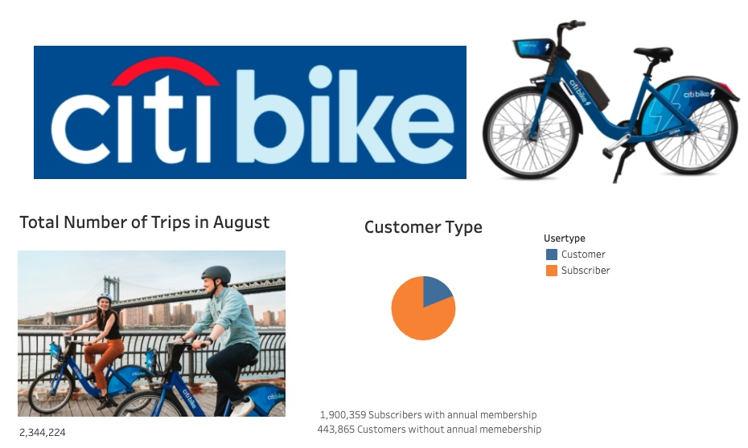

# bikesharing

## Overview of the analysis

The following analysis is based on a CitiBike data-share dataset. The main purpose is to get insightful visualizations and come up with a business proposal to get seed funding to launch a similar bike-share company in Des Moines, Iowa.

## Results
[link to dashboard](https://public.tableau.com/profile/jose2446#!/vizhome/bikesharedata_16110289834760/Story1?publish=yes)

The first dashboard we have created showcases the number of total trips from August and also the type and number of customers. 

There were 2,334,224 rides during the month of August. Furthermore, the pie chart shows the total number of subscribers with annual membership vs the numbers of users without membership.

The second dashboard has the breakdown of users by gender as shown in the pie chart. Below, we have two horizontal bar charts with the number of rides by user-type and gender on the left and the percentage of total on the right. 

The third dashboard is a horizontal bar chart with the number of rides or usage by the hour. Each bar represents the time when a user starts a ride in any location. The color gradient helps us visualize the peak hours.

The fourth dashboard consists of two line charts. Both charts present the duration in time per trip. The top chart is a general representation of user data whereas the bottom chart is broken down by gender. As we can see, the peak hours are from 4-7 pm and the highest numbers are male riders.

The fifth dashboard has two heatmaps which represent the number of trips by the hour per weekday. The left map contains general user data versus the right one which is broken down by gender. As we can see in the image below, the darkest areas happen around 4-7 pm which are the most active hours of the day regardless of gender or day. 

The sixth dashboard shows two symbol maps. On the left side with the top starting locations, which means that most users start their rides at these locations. On the right side, we have the top ending locations or the most relevant drop-off locations. The marker’s size is proportional to the number of started rides count and the color gradient as well. 

Finally, in our last dashboard, we have represented the usage by user type, gender, and age. 

The "User trips by gender by weekday" breaks down the ride data by customer type, weekday, and gender. As we can see below, most users are male and the busiest day of the week is Thursday. 

The "Trips by gender" horizontal bar chart, depicts the percentage of usage by gender. We can observe that more than 60% of the rides were from male users. 

The "Average trip duration by age group" is a stacked bar chart with the average trip duration by age group. 

Lastly, the "Average trip duration by gender" shows the average trip duration by sex. Surprisingly, even though the male users and female users are significantly more than unknown users, the average trip duration by these unknown users is the highest, followed by female users.

## Summary 

As per our analysis, we can infer that the main users of the Citibike service are young and mid-aged adults, primarily male users. Furthermore, the peak hours happen during 4-7 pm which is when most people are getting out of work. It is important to plan any bike repairs or maintenance before or after these hours. Lastly, the most used spot happens to be in Manhattan, which is where there are more tourists so for our plan of bike-share in Des Moines, we should focus on serving the areas where most people commute into and from work as well as the areas where most tourists visit.
 
Additional visualizations that could help
further the analysis could be:
 
* Frequency of maintenance needed.
* Revenues vs expenses.
